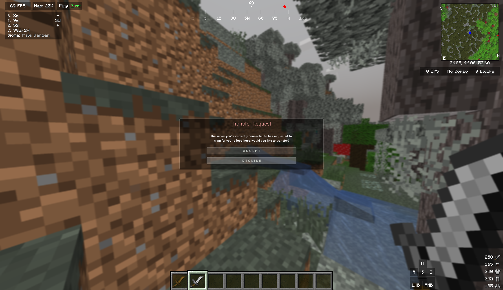

# LunarServerRedirect

LunarClientを使用しているプレイヤーをコマンドで他サーバに送信できるPlugin 
Spigot、Paper、Bungeecord、Velocityに対応しています 
[English Description & Spigot Page is here！](https://www.spigotmc.org/resources/lunarserverredirect.129524/) 

## Dependency
* [Apollo](https://github.com/LunarClient/Apollo/releases)

## How to Use?
0. Apolloという依存関係にあるプラグインを事前にpluginフォルダに入れておいてください。
1. `/lunarserverredirect ユーザー名 アドレス` を実行
2. LunarClientユーザーは、入力したサーバーに移動できます！

## Permission
* `lunarserverredirect.command.lunerserverredirect` コマンドを使って別サーバーに移動させるための権限です。

## OtherClient(Mod)
他のクライアントを使っている方はこちらを使用すると同じことができます。 
(私が尊敬しているプロジェクトです！ぜひ使ってみてください！) 
[ServerRedirect](https://github.com/KaiKikuchi/ServerRedirect)

## Bedrock(Geyser)
統合版を使っている方はこちらを使用すると同じことができます。 
[GeyserServerTransfer](https://github.com/Shin-Ideal/GeyserServerTransferPlugin)
